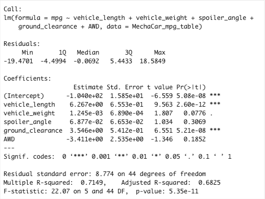
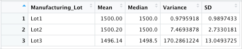

# MechaCar_Statistical_Analysis

This is an analysis about the mpg of MechaCar prototypes by using R.
The data sets  and  were used for this analysis.

## Outlines

A multiple linear regression analysis were performed to identify which variables in the dataset predict the mpg of MechaCar prototypes. Summary statistics on the pounds per square inch (PSI) of the suspension coils from the manufacturing lots was collected. t-tests was run to determine if the manufacturing lots are statistically different from the mean population. And finally,a statistical study was designed to compare vehicle performance of the MechaCar vehicles against vehicles from other manufacturers. For each statistical analysis, you’ll write a summary interpretation of the findings.

In aeach of these four analysis the results were reported in this document.

## Linear Regression to Predict MPG

The summary statistics of the model is given in the following:

According to summary information 

The model is 

> mpg=-104+6.267Xvehicle_length+0.001245Xvehicle_weight+0.06877Xspoiler_angle+3.546Xground_clearance-3.411XAWD

1. Intercept and the variables veicle_length and ground_clearance are non-random amount of variance to the mpg values in the dataset. 

2. The slope of dataset can  be considered as 0. Because, p_value=5.35x10^-11 which is almost 0.

3. We may say that the linear model predict mpg of MechaCar prototypes effectively, because multiple R-squared is 0.7149 (larger than o.7), so the correlation is strong.

You can find the complete Rmd file in the following link:

## Summary Statistics on Suspension Coils

Total Summary statistics of suspension Coils is in the following table:

And, the summary statistics according to losts is given as

The design specifications for the MechaCar suspension coils dictate that the variance of the suspension coils must not exceed 100 pounds per square inch. So according to total_summary data frame, the current manufacturing data meets this design specification for all manufacturing lots in total because the variance is 62.29. According to lot_summary data frame, he current manufacturing data meets this design specification for all manufacturing lots 1 and 2 but does not meet lot 3; because the varieneces are 0.98, 7.47 and 170.29 respectively. 

## T-Test on Suspension Coils

## Design a Study Comparing the MechaCar to the Competition
